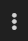
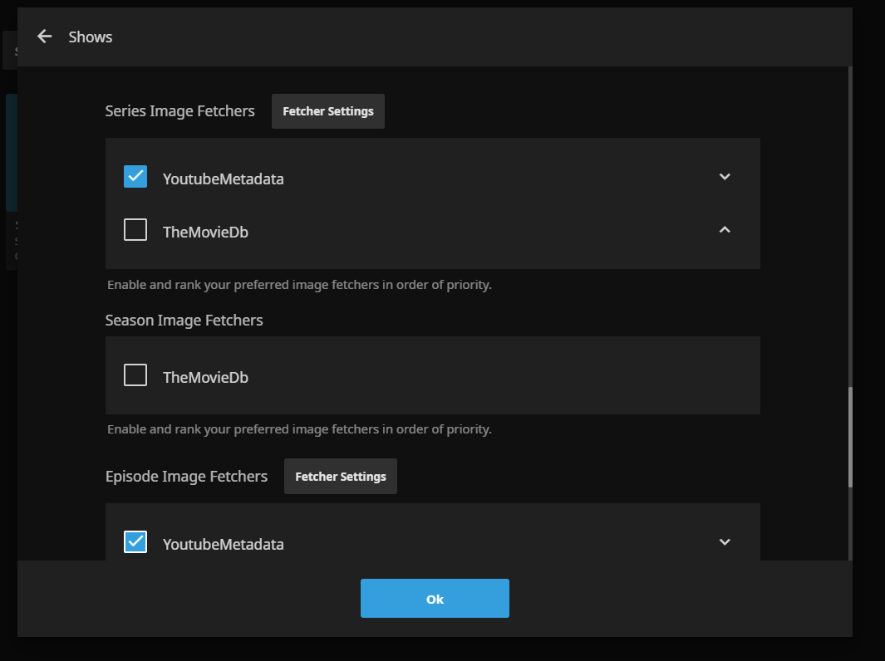

[](https://github.com/ankenyr/jellyfin-youtube-metadata-plugin/releases/latest)
[](https://github.com/ankenyr/jellyfin-youtube-metadata-plugin/actions?workflow=build)
[](https://ko-fi.com/ankenyr)

# Jellyfin Youtube Metadata Plugin

## Overview

Plugin for [Jellyfin](https://jellyfin.org/) that retrieves metadata
for content from Youtube.

### Features

- Local provider uses the `info.json` files provided from [yt-dlp](https://github.com/yt-dlp/yt-dlp) or similar programs.
- Remote provider uses [yt-dlp](https://github.com/yt-dlp/yt-dlp) to download `info.json` files.
- Supports thumbnails of `jpg` or `webp` format for both channel and videos
- Supports the following library types
  - Movies
  - Music Videos
  - Shows
- Supports ExternalID providing quick links to source of metadata.

### Requirements

- [yt-dlp](https://github.com/yt-dlp/yt-dlp) is required if you are using the remote provider.

## Installation

### Prerequirements

You are required to have yt-dlp available on the system or container Jellyfin is running on. The following are examples of how you could do this depending on your setup and are not to be considered an exhaustive list.

#### Installing from package manager

APT: `sudo apt-get install yt-dlp`
Nix package manager: also called `yt-dlp`

#### Installing in a container

```sh
docker exec -it -u root jellyfin bash
curl -L https://github.com/yt-dlp/yt-dlp/releases/latest/download/yt-dlp -o /bin/yt-dlp
chmod a+rx /bin/yt-dlp
apt update && apt install --no-install-recommends --no-install-suggests python3
```

#### Building a docker image depending on YT-DLP

```dockerfile
FROM linuxserver/jellyfin:nightly
RUN apt-get update && apt-get install -y \
    python3-pip
RUN python3 -m pip install -U yt-dlp
```

### Installing From Repository (Recommended)

1. Go to the `Admin Dashboard`.
1. In the left navigation menu, click on `Plugins`.
1. In the top menu, click `Repositories`.
1. Click the `+` icon to add a new repository.
1. `Repository Name` can be anything.
1. `URL` must be `https://raw.githubusercontent.com/ankenyr/jellyfin-plugin-repo/master/manifest.json`
1. If done correctly you should see a new repository on the page.
1. In the top menu, navigate to `Catalog`.
1. Under the `Metadata` section click on `YoutubeMetadata`.
1. Click `Install`.
1. Restart Jellyfin.
1. On the left navigation menu, click on Plugins.
1. If successful, you will see `YoutubeMetadata` with status as `Active`

### Manual Installation (Hard)

1. Navigate to the [releases page](https://github.com/ankenyr/jellyfin-youtube-metadata-plugin/releases).
1. Download the latest zip file.
1. Unzip contents into `<jellyfin data directory>/plugins/YoutubeMetadata`.
1. Restart Jellyfin.
1. On the left navigation menu, click on Plugins.
1. If successful, you will see `YoutubeMetadata` with status as `Active`

## Usage

### File Naming Requirements

All media needs to have the ID embeded in the file name within square brackets.
The following are valid examples of a channel and video.
- `3Blue1Brown - NA - 3Blue1Brown_-_Videos [UCYO_jab_esuFRV4b17AJtAw].info.json`
- `3Blue1Brown - 20211023 - A_few_of_the_best_math_explainers_from_this_summer [F3Qixy-r_rQ].mkv`

`info.json` and image files need to have the same file name as the media file. As an example, this would cause a breakage
- `3Blue1Brown - 20211023 - A_few_of_the_best_math_explainers_from_this_summer [F3Qixy-r_rQ].mkv`
- `3Blue1Brown - 20211023 [F3Qixy-r_rQ].info.json`

The proper naming format is the default when using [yt-dlp](https://github.com/yt-dlp/yt-dlp)
and is also enforced in [TheFrenchGhosty's Ultimate YouTube-DL Scripts Collection](https://github.com/TheFrenchGhosty/TheFrenchGhostys-Ultimate-YouTube-DL-Scripts-Collection) which I highly recommend.

### Enabling Provider

1. Navigate to your `Admin Dashboard`.
1. On the left navigation menu, click `Libraries`.
1. Click on  for a supported library type.
1. Click `Manage library`.
1. Click the checkbox next to `YoutubeMetadata` for each downloader or fetcher you wish to enable. In the image below you can see two enabled.

1. Click `OK`.
1. Click `Scan All Libraries`.

### Providing Cookies to YT-DLP

***Warning*** your cookie grants access to accounts the cookie is granted for. Please protect this file if you decide to use it.
Placing a file named `cookies.txt` into the `<jellyfin data directory>/plugins/YoutubeMetadata` plugin directory will enable YT-DLP to start using your cookie.

## Contributing

For building from source, contributing and release details see [CONTRIBUTING.md](CONTRIBUTING.md).

## Donations

If this plugin helps you, please consider a donation!
You can use my [ko-fi](https://ko-fi.com/ankenyr) link.
If you would rather donate in some way not supported yet, let me know how you would like to donate.
